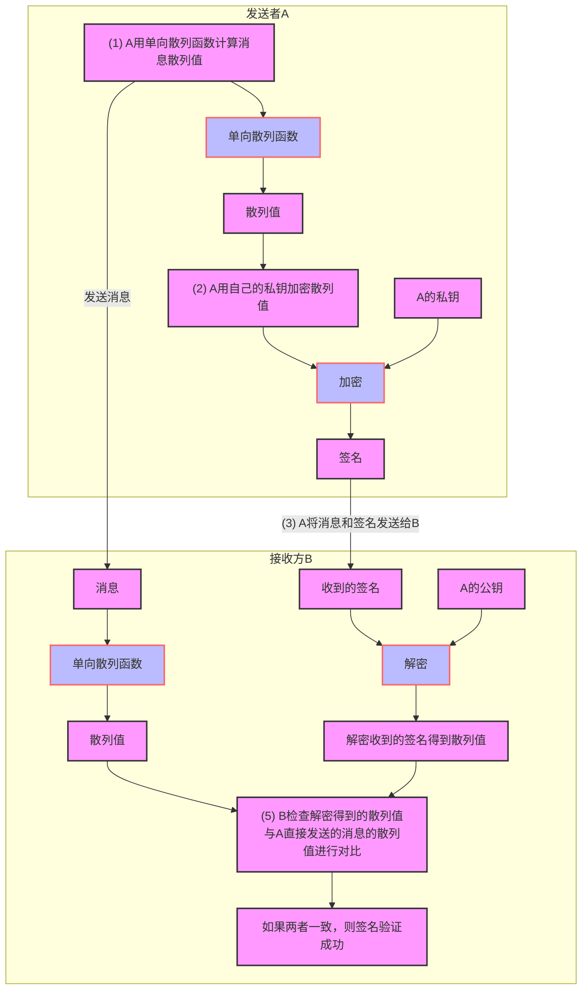

## 对称加密
- 使用相同的密钥：加密和解密使用的是同一个密钥，因此称为对称加密。
- 速度快：加密和解密的速度比非对称加密快，适合处理大数据量的加密。
- 安全性依赖于密钥传输：双方必须事先安全地共享密钥，这样在通信过程中才能使用相同的密钥进行加密和解密。如果密钥在传输中被拦截，通信就可能不安全。
- 常见算法：AES、DES

## 非对称加密
- 使用不同的密钥：非对称加密使用一对密钥，公钥和私钥。公钥用于加密，私钥用于解密。公钥可以公开，私钥必须保密。
- 速度慢：加密和解密的速度较慢，适合加密较小的数据或用来安全传递对称加密密钥。
- 安全性高：即使公钥公开，只有持有私钥的人才能解密加密的数据，因此传输过程的安全性较高。
- 常见算法：RSA、DSA

## 数字签名
> [!IMPORTANT]
> 生成数字签名有两种方法，一种是直接对消息签名的方法，另一种是对消息的散列值签名的方法。
> 直接对消息签名的方法需要对整个消息进行加密，再加上非对称加密本来就速度较慢，所以这种方法非常耗时。

#### 对消息散列值进行签名的逻辑
